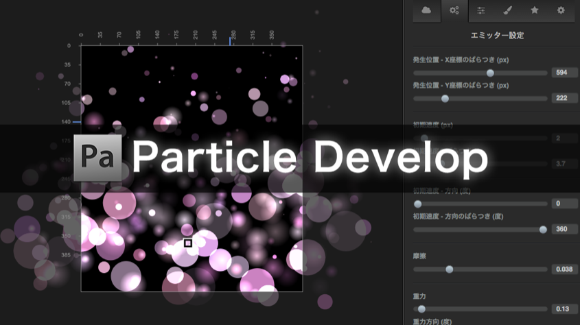

# Particle Develop

## Description
Particle DevelopはHTML5製のデザインツールです。雪や炎、キラキラなどのパーティクル表現を作成でき、ベクター画像として保存することができます。Adobe Illustratorのイラスト制作にも役立ちます。

- [core 共通ソースディレクトリ](core/)
- [desktop デスクトップ用のソースディレクトリ](desktop/)
- [sp モバイル用のソースディレクトリ](sp/)
